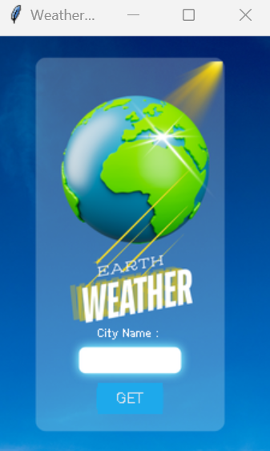
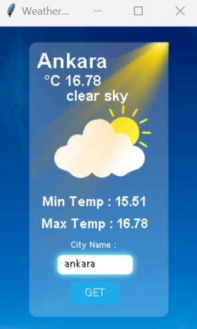
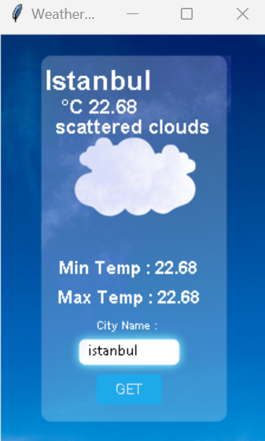
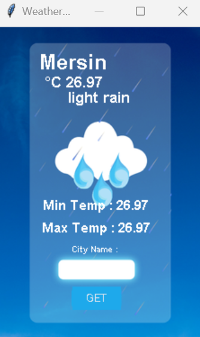
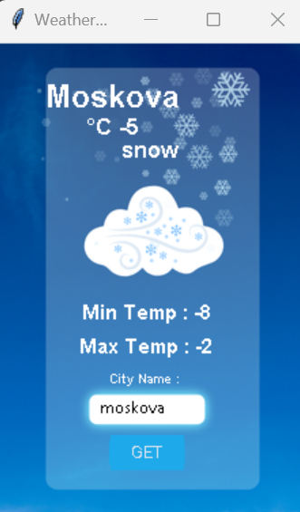

# 🌤 Weather App (Tkinter + OpenWeatherMap)

A simple desktop weather application built with **Python**, **Tkinter**, and the **OpenWeatherMap API**.  
It allows users to enter a city name and get real-time weather data with a background image that changes based on the weather conditions.

---

## 🚀 Features
- Fetches real-time weather data using [OpenWeatherMap](https://openweathermap.org/).
- Displays:
  - Current temperature (°C)
  - Min & max temperatures
  - Weather description (e.g., clear, cloudy, rain, snow, etc.)
- Dynamic background image depending on the weather condition.
- Minimal UI using **Tkinter** and **CustomTkinter**.

---

## 🖼 Screenshot







---

## ▶️ Usage

Run the application:
```bash
python main.py


📂 Project Structure

weather-app/
│-- main.py            # Main application file
│-- background.png     # Default background image
│-- sun.png            # Sunny weather background
│-- clouds.png         # Cloudy weather background
│-- rain.png           # Rainy weather background
│-- snow.png           # Snowy weather background
│-- storm.png          # Thunderstorm background
│-- README.md          # Project documentation


🔑 API Information
       - The app uses OpenWeatherMap Current Weather Data API.
       - Docs: https://openweathermap.org/current


🛠 Technologies Used

    ~ Python 3.x
    ~ Tkinter (GUI)
    ~ CustomTkinter (modern UI)
    ~ Pillow (image handling)
    ~ Requests (API calls)

📜 License

This project is licensed under the MIT License – feel free to use and modify it.


🤝 Contributing

Pull requests are welcome. For major changes, please open an issue first to discuss what you would like to change.


✨ Author

Developed by [Gökhan Bişar]
